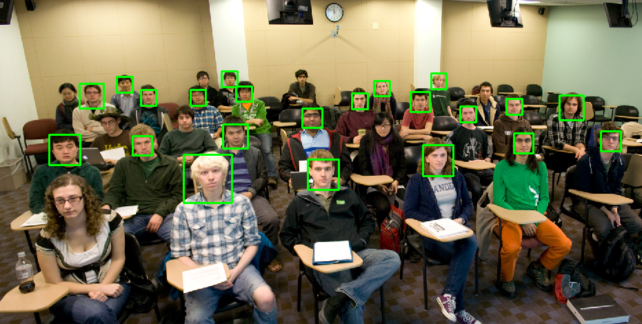

# Face Detection
> Vanilla Face detection methods using OpenCV, Dlib and Python.

[](https://www.python.org/)
[](https://www.gnu.org/licenses/gpl-3.0)


Webcam experiments with Face Detection



## Execution
All the experiments are executed from the same python file:

```
python FaceDetection.py
```
## Instructions
To  go for the next experiment press 'n' or terminate pressing 'q'.


